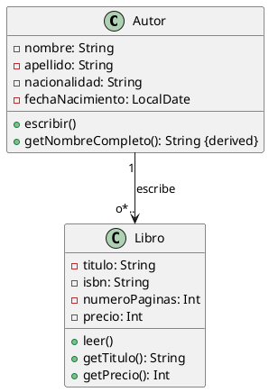

# Ejercicio 1: Diagrama de Clases - Sistema de Libros y Autores

## Descripción del Problema

Diseña un diagrama de clases para un sistema básico de gestión de libros y autores de una biblioteca.

```plantuml
@startuml

class Autor {
  - nombre: String
  - apellido: String
  - nacionalidad: String
  - fechaNacimiento: LocalDate
  + escribir()
  + getNombreCompleto(): String {derived}
}

class Libro {
  - titulo: String
  - isbn: String
  - numeroPaginas: Int
  - precio: Int
  + leer()
  + getTitulo(): String
  + getPrecio(): Int 
}

Autor "1" --> "o*.." Libro : escribe

@enduml

```