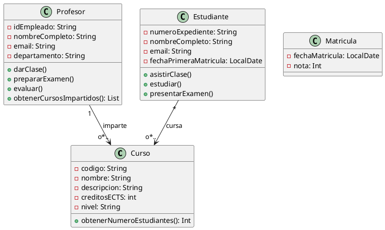

# Ejercicio 2: Diagrama de Clases - Sistema de Gestión de Cursos Universitarios

## Descripción del Problema

Una universidad necesita informatizar la gestión de sus cursos académicos. T

```plantuml
@startuml

class Curso {
  - codigo: String
  - nombre: String
  - descripcion: String
  - creditosECTS: int
  - nivel: String
  + obtenerNumeroEstudiantes(): Int
}

class Profesor {
  - idEmpleado: String
  - nombreCompleto: String
  - email: String
  - departamento: String
  + darClase()
  + prepararExamen()
  + evaluar()
  + obtenerCursosImpartidos(): List
}

class Estudiante {
  - numeroExpediente: String
  - nombreCompleto: String
  - email: String
  - fechaPrimeraMatricula: LocalDate
  + asistirClase()
  + estudiar()
  + presentarExamen()
}

class Matricula {
  - fechaMatricula: LocalDate
  - nota: Int
}

Profesor "1" --> "o*.." Curso : imparte
Estudiante "*" --> "o*.." Curso : cursa

@enduml
```