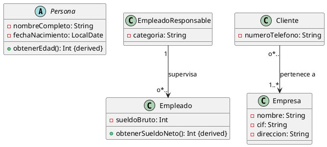

# Ejercicio 4: Diagrama de Clases - Sistema de Gestión Empresarial

## Descripción del Problema

Una empresa de consultoría necesita desarrollar un sistema para gestionar la información de sus empleados, clientes y las empresas con las que trabajan. El sistema debe mantener datos personales, estructuras jerárquicas y relaciones comerciales entre las diferentes entidades.

