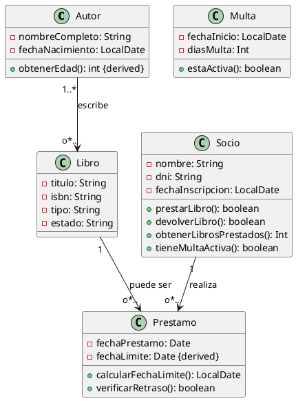

# Ejercicio 6: Diagrama de Clases - Sistema de Biblioteca

## Descripción del Problema

Una biblioteca municipal necesita informatizar su sistema de gestión de libros y préstamos. El sistema debe controlar el catálogo de libros, los autores, los socios lectores y el estado de cada préstamo.

