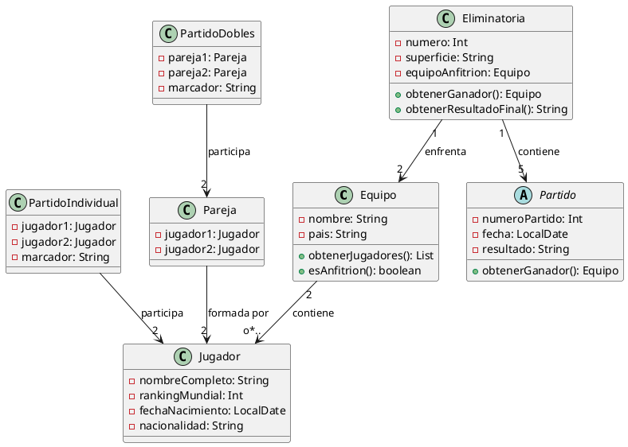

# Ejercicio 7: Diagrama de Clases - Copa Davis de Tenis

## Descripción del Problema

La Federación Internacional de Tenis necesita un sistema para gestionar la Copa Davis, una competición por equipos entre países. El sistema debe controlar equipos, jugadores, eliminatorias, partidos (individuales y dobles) y resultados.

